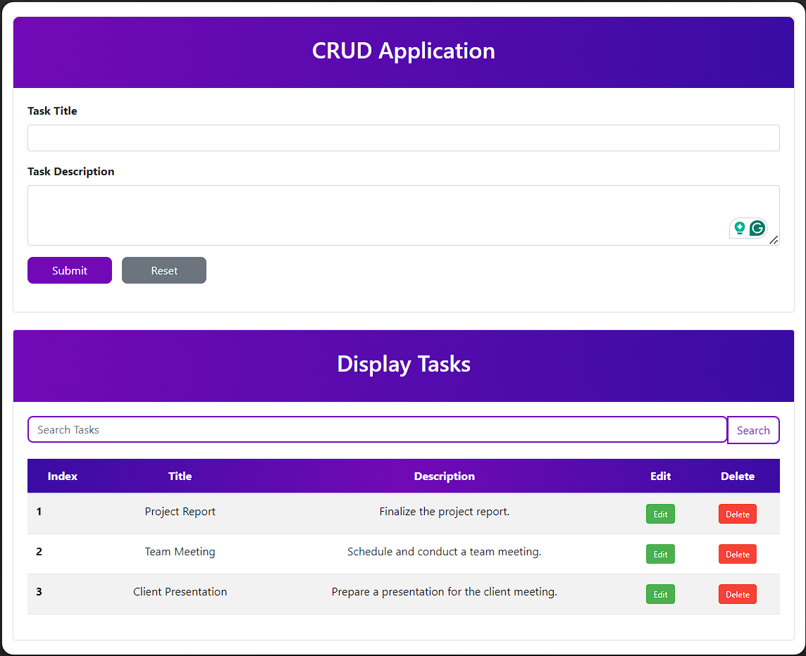

# Task Management Application

Welcome to the Task Management Application! This application allows you to create, edit, delete, and search tasks efficiently. The application is built using HTML, CSS, and Bootstrap for the frontend, and is deployed on Vercel.

## Live Demo

Check out the live application [here](https://task-management-ivory-alpha.vercel.app/).

## Features

- **Create Tasks**: Add new tasks with a title and description.
- **Edit Tasks**: Modify existing tasks with ease.
- **Delete Tasks**: Remove tasks that are no longer needed.
- **Search Tasks**: Search for tasks based on their title or description.
- **Responsive Design**: The application is fully responsive and works on all devices.

## Technologies Used

- **HTML**: For the structure of the application.
- **CSS**: For styling the application.
- **Bootstrap**: For enhanced styling and responsive design.
- **JavaScript**: For adding interactivity to the application.
- **Vercel**: For deployment.

## Installation

To run this project locally, follow these steps:

1. Clone the repository:
    ```sh
    git clone https://github.com/chaman-yadav/Task-Management.git
    ```
2. Navigate to the project directory:
    ```sh
    cd task-management
    ```
3. Open `index.html` in your favorite web browser.

## Usage

1. **Creating a Task**:
    - Fill in the task title and description.
    - Click on the "Submit" button to add the task to the list.

2. **Editing a Task**:
    - Click on the "Edit" button next to the task you want to modify.
    - Update the task title and description in the form.
    - Click on the "Update" button to save the changes.

3. **Deleting a Task**:
    - Click on the "Delete" button next to the task you want to remove.

4. **Searching for Tasks**:
    - Enter a keyword in the search bar.
    - Click on the "Search" button to filter tasks based on the keyword.

## Code Explanation

The JavaScript code is responsible for handling the main functionalities of the application:

- **Task Creation**: The `createTask` function adds a new task to the list.
- **Task Editing**: The `editTask` function populates the form with the task details, allowing you to edit them.
- **Task Updating**: The `updateTask` function updates the task with new details.
- **Task Deletion**: The `deleteTask` function removes a task from the list.
- **Task Search**: The `searchTasks` function filters tasks based on the search input.
